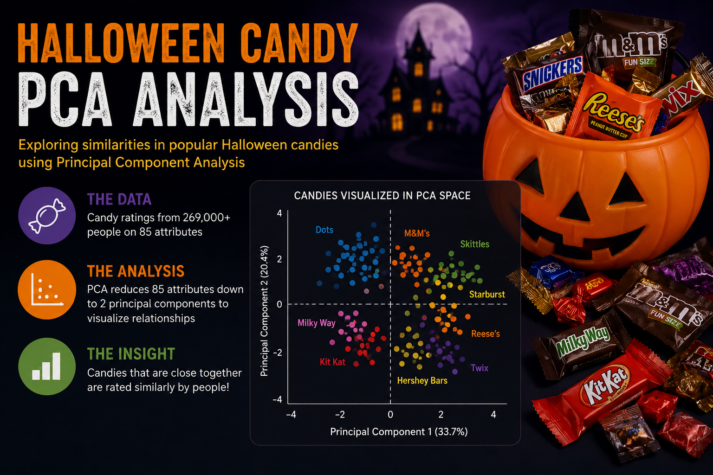

# 🎃 Halloween Candy Data Analysis



## Overview

This project explores a Halloween candy dataset using **Python**, **Principal Component Analysis (PCA)**, and **Tableau** to identify patterns and similarities between different candy types.

The goal of the analysis is to reduce the complexity of multiple candy features into two principal components that can be visualized in a scatter plot for easier interpretation.

---

# 📊 Project Objectives

* Analyze characteristics of Halloween candies
* Apply dimensionality reduction using PCA
* Visualize candy similarities and clustering patterns
* Prepare cleaned PCA output data for Tableau visualization
* Explore how candies compare based on their features

---

# 🛠️ Technologies Used

* **Python**
* **Pandas**
* **NumPy**
* **Matplotlib**
* **Scikit-learn**
* **Jupyter Notebook**
* **Tableau**

---

# 📁 Dataset

The project uses the `candy-data.csv` dataset containing information about different Halloween candies and their characteristics.

Some of the features in the dataset include:

* Chocolate
* Fruity
* Caramel
* Peanut/Almond
* Nougat
* Crisped Rice/Wafers
* Hard Candy
* Bar
* Pluribus
* Sugar Percentage
* Price Percentage
* Win Percentage

---

# 🔍 Principal Component Analysis (PCA)

The notebook applies **Principal Component Analysis (PCA)** to reduce the candy feature space into two dimensions.

PCA helps:

* Simplify high-dimensional data
* Identify hidden patterns
* Visualize relationships between candies
* Detect clusters and similarities

The project transforms the candy features into:

* **Principal Component 1 (PC1)**
* **Principal Component 2 (PC2)**

These components are then plotted in a scatter plot.

---

# 📈 Workflow

## 1. Import Libraries

The project begins by importing the required Python libraries:

```python
import pandas as pd
import numpy as np
import matplotlib.pyplot as plt
from sklearn.decomposition import PCA
```

---

## 2. Load Dataset

```python
halloween = pd.read_csv("candy-data.csv")
```

The dataset is loaded into a Pandas DataFrame for analysis.

---

## 3. Feature Selection

```python
subset = halloween.iloc[:,1:-3]
```

Relevant candy feature columns are selected for PCA transformation.

---

## 4. Apply PCA

```python
pca = PCA(n_components=2)
pca.fit(subset)
```

The dimensionality of the dataset is reduced to two principal components.

---

## 5. Transform Data

```python
candy_2d = pd.DataFrame(pca.transform(subset))
```

The candy data is projected into 2D PCA space.

---

## 6. Visualization

```python
candy_2d.plot(kind='scatter', x=0, y=1)
```

Scatter plots are used to visualize the relationships between candies.

Additional jitter was added to improve visualization readability:

```python
halloween['x_jitter'] = candy_2d[0] + np.random.randn(85)*0.1
halloween['y_jitter'] = candy_2d[1] + np.random.randn(85)*0.1
```

---

## 7. Export Processed Data

```python
halloween.to_csv('halloween_pca.csv')
```

The transformed dataset is exported for further Tableau visualization.

---

# 📊 Tableau Integration

The exported PCA dataset can be imported into Tableau to create:

* Interactive scatter plots
* Candy clustering dashboards
* Hover tooltips
* Comparative visual analysis
* Custom dashboards and storytelling visuals

---

# 📌 Key Insights

* PCA reduces complex candy attributes into easy-to-visualize dimensions
* Similar candies tend to cluster together in PCA space
* Visualization helps uncover relationships between candy characteristics
* Jittering improves readability by reducing overlap in scatter plots

